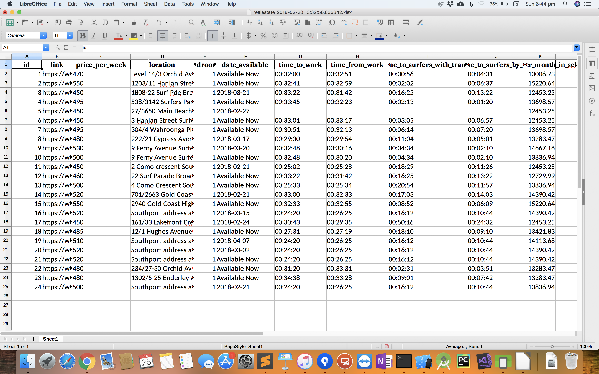

# Real estate finder
Location, location, location!
When I was searching for an apartment in Gold Coast, Australia, I wanted to have a tool that would list travel times to
some important locations. For me it was travel time to and from work during rush hour, and time with public transport
to the city centre.
This python script does a few things:
1. You give it a start search.
2. The script will find the travel time to the locations (that you need to edit)
3. Output into excel

I was experimenting a bit with making it a web app but kinda gave up. It works though, but you need to manually edit the
code in a few places. Hope you find it as useful as I did!

### Prerequisites
Python 3, pip, ..
Just use Anaconda. It is great.

## Authors
* **Sebastian Nilsson** - [sebastiannilsson.com](http://sebastiannilsson.com)

## License
* All code is licensed under the MIT License - see the [LICENSE](LICENSE) file for details

 
## Support my creation of open source software:

